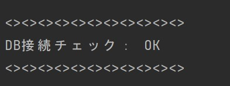
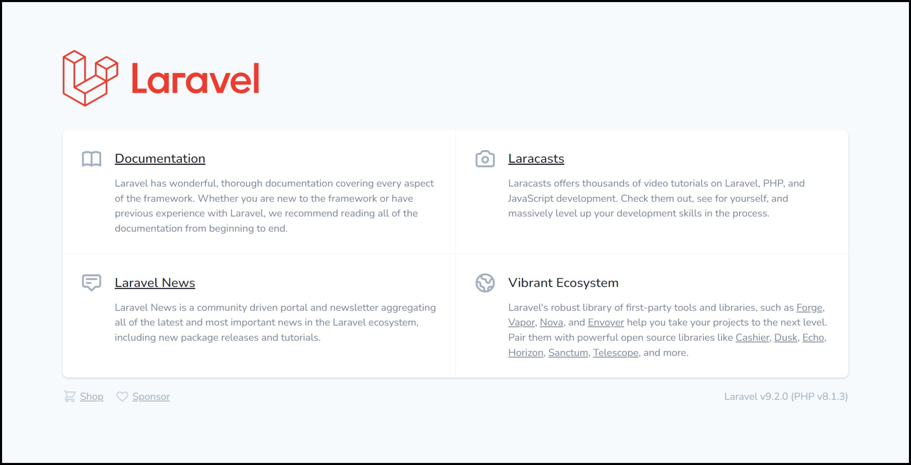
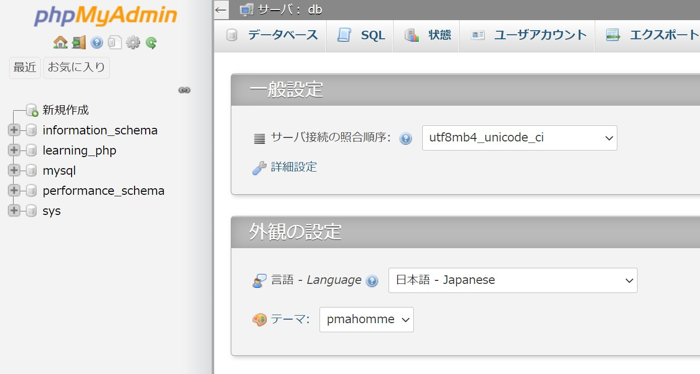

# PHP Laravel版 本気の Docker サンプル

プログラミング学習をする上で環境構築は必要ではあるものの、Docker理解の優先度は低いです。  
学習者にとっては早くプログラミング学習に着手したいのに、環境構築でつまずいてしまいプログラミング学習時の苦手意識を植え付けてしまう大きな要因の１つとなっています。

ここ数日でそのような方を数人サポートした経緯もあり、本気のDockerサンプルシリーズを用意してみようと思いました。

## ご利用の際のお願い

ご利用の際にはTwitterのフォローをお願いします。  
[@tarotyjp (saburo)](https://twitter.com/tarotyjp)

また、ハッシュタグ `#本気のDockerサンプル` と [本気のDockerサンプル](https://github.com/tarotyjp/sample-series) のURLと一緒にツイートしていただけると嬉しいです。

ツイートサンプル（コピペOK）

```text
PHP Laravel版 本気のDockerサンプル でプログラミング学習始めましたー
https://github.com/tarotyjp/sample-series

#本気のDockerサンプル
#駆け出しエンジニアとつながりたい 
#プログラミング初心者 
#プログラミング初学者と繋がりたい 
```

## 概要

このサンプルは「本気のDockerサンプルシリーズ」の一つです。  
本気のDockerサンプルシリーズの一覧は下記よりご確認ください。

- [本気のDockerサンプルシリーズ](https://github.com/tarotyjp/sample-series)

いま最も使われているPHPフレームワークであるLaravelを利用した学習に最適化したDockerサンプルです。  
このサンプルでは下記が利用できるようになっています。

- Linux / Nginx / MySQL / PHP / Laravelを利用した開発環境
- phpMyAdmin によるデータベース管理
- cronによる定期実行環境
- xdebugにも対応
    - 詳細は省略します

また、Laravelプロジェクトの作成をサポートするシェルも用意してあります。（後述）

**ご注意**  
このサンプルはWindows環境で作成しており、Macでの動作確認はしておりません。  
そのため、とくにM1/M2シリーズのMacではエラーが発生する可能性もあります。  

## 利用されるバージョン

このサンプルで利用しているバージョンは下記のとおりです。  
適宜 `Dockerfile` を修正して学習に併せたバージョンでご利用ください。

| 環境      | バージョン | 補足                                     |
|---------|-------|----------------------------------------|
| PHP     | 8.1   | `./src/learning` 配下で実装してください           |
| MySQL   | 5.7   | phpMyAdminを使うと便利です                     |
| Nginx   | 1.20  | DocumentRoot は `./src/learning/public` |
| Laravel | 9.x   | 2022年2月時点の最新                           |

PHPのバージョンは2022年2月時点のLaravel最新バージョンであるv9に併せて設定してあります。  
学習したいLaravelのバージョンに合わせて `./docker/php/Dockerfile` を修正してください。

Laravelのバージョンに対応するPHPバージョンは下記公式情報で確認できます。  
[Laravel Release Notes#Support Policy](https://laravel.com/docs/8.x/releases#support-policy)

Laravelの調べ物をする際、５系も多くヒットしますため５系で学習される方も多いと思いますが、５系は公式ページに情報がないためQiita記事を載せておきます。  
[Laravel リリース・サポート期限
](https://qiita.com/kidatti/items/c293ad9345c1130f150e)

しかし、これから学習をするのであれば、公式サイトに記載のあるバージョンを利用することを **強く推奨** します。  
そして、可能な限り最新での学習を強く推奨します。

### 修正例） Laravel6で学習したい場合

---

**＊注意**  
全てのバージョンの組み合わせは試していません。  
下記のみ簡単な動作確認をしています。

| Laravelバージョン | 利用するPHPバージョン     |補足|
|--------------|------------------|---|
| Laravel 9    | FROM php:8.1-fpm |2022年2月時点の最新|
| Laravel 6    | FROM php:8.0-fpm      |2019年9月リリースのLTS|
| Laravel 5.5  | FROM php:7.4-fpm      |2017年8月リリースのLTS|

---

Laravel6で学習したい場合は下記の通り修正してください。  
全部で３つのファイルを修正します。

- 修正対象ファイル：`./docker/php/Dockerfile`
- 行数：１行目

```text
FROM php:8.0-fpm
```

- 修正対象ファイル：`./docker/cron/Dockerfile`
- 行数：１行目

```text
FROM php:8.0-fpm
```

- 修正対象ファイル：`./docker-compose.yml`
- 行数：28行目付近

```text
      LARAVEL_VERSION: "6.*"
```

## 環境セットアップ

ダウンロードからコンテナの作成までの使い方について詳しく知りたい方は下記を参考に準備しましょう。  
その後こちらにもどり手順を確認してください。

[本気のサンプルシリーズの使い方](https://github.com/tarotyjp/sample-series/blob/main/manuals/download-docker.md)

リポジトリをクローンして下記を実行してください。

1. docker-compose build --no-cache
2. docker-compose up -d

また、Laravelプロジェクトの作成をサポートするシェルも用意してあります。  
下記１行を実行すると `./src/learning` に 作成されます。

実行ている事を簡単に書いておくと下記のとおりです。

- プロジェクトの作成
- フォルダ周りの準備
- 設定ファイルを用意
- DB接続確認

より詳細を知りたい方は `./src/laravel.sh` をご参照ください。  
日本語でコメントを書いてあります。

このシェルを利用したい方は下記を実行してください。

```shell
docker-compose exec php bash ../laravel.sh
```

DBの接続に成功すれば下記のように表示されます。




## 環境を作り直したい時

---

**＊注意**  
こちらを実行するとデータベースに保存していた情報はすべて削除されます。  
PHPなどの成果物は削除されません。

---

環境を作り直したい時のために全てを削除するシェルを作ってあります。

それぞれの環境に合わせて下記を実行し、前述の「環境セットアップ」を実行してください。

Windows

```
docker-down-all.bat
```

Mac

```
bash docker-down-all.sh
```

## 動作確認

### PHP学習用の動作確認

下記にアクセスすることで動作確認できます。

[http://localhost:8080/index.php](http://localhost:8080/index.php)

下記画面が表示されれば動作確認OKです。



### phpMyAdminの動作確認

下記にアクセスすることで動作確認できます。

[http://localhost:8000/index.php](http://localhost:8000/index.php)

下記画面が表示されれば動作確認OKです。



### 定期実行環境の動作確認

定期実行が不要な場合は確認不要です。

確認するためには下記手順を踏んでください。  
各作業の詳細は後述します。

1. `cron_root.txt` を修正
2. dockerコンテナの再起動
3. 出力先を確認
4. `cron_root.txt` を戻す
    1. お忘れなく！

#### 1. `cron_root.txt` を修正

`./docker/cron/cron_root.txt` を開き下記のように修正します。

before

```text
# test command
# * * * * * date >> /tmp/cron/test.txt
```

after(２行目行頭の#を削除)

```text
# test command
* * * * * date >> /tmp/cron/test.txt
```

#### 2. dockerコンテナの再起動

dockerコンテナを再起動します。

- `docker down`
    - `docker stop` ではないので注意
- `docker up -d`

#### 3. 出力先を確認

下記を実行して自動実行を確認します。

```shell
docker-compose exec cron cat /tmp/cron/test.txt
```

下記のように１分おきに出力されていればOK

```text
Mon Feb 28 00:15:00 UTC 2022
Mon Feb 28 00:16:00 UTC 2022
Mon Feb 28 00:17:00 UTC 2022
Mon Feb 28 00:18:00 UTC 2022
Mon Feb 28 00:19:00 UTC 2022
```

#### 4. `cron_root.txt` を戻す

こちらを忘れると、１分ごとの出力が停止されませんのでご注意ください。

`./docker/cron/cron_root.txt` を開き下記のように修正します。

before

```text
# test command
* * * * * date >> /tmp/cron/test.txt
```

after(２行目行頭に#を追加)

```text
# test command
# * * * * * date >> /tmp/cron/test.txt
```
